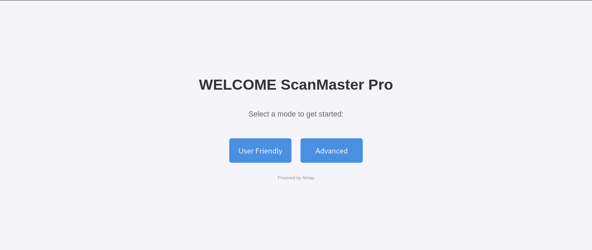
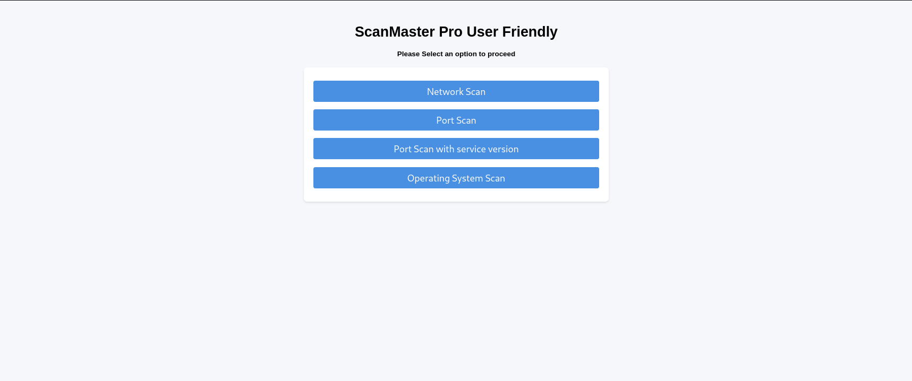
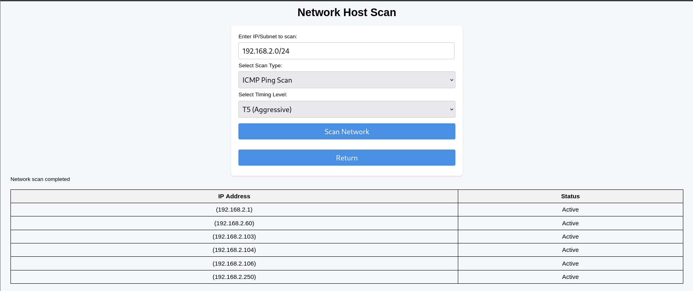
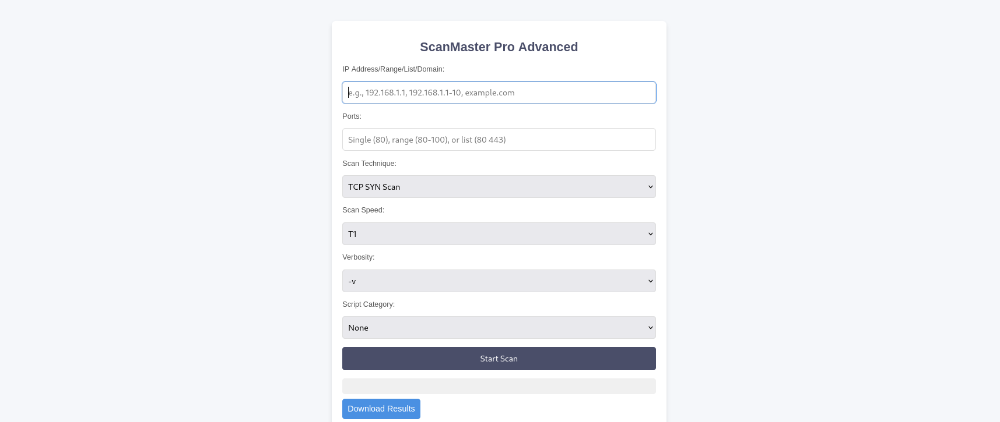

# Nmap Web Interface

This project provides a **web interface** to simplify the use of Nmap tools. It offers two modes:
- **User-friendly mode** for easy scanning.
- **Advanced mode** for experienced users who need full control over Nmap options.

A `Dockerfile` is included to enable deployment in a **Docker environment**.

---

## 🚀 Running Without Docker

To run the application without Docker, follow these steps:

1️⃣ **Download the repository**:
```sh
git clone https://github.com/mrigla-b1/nmap-web-interface.git
```

2️⃣ **Navigate to the project directory**:
```sh
cd nmap-web-interface
```

3️⃣ **Run the application**:
```sh
python3 nmap-web-interface.py
```

4️⃣ **Access the web interface** using your browser.

---

## 📸 Screenshots
Here are some previews of the interface:






---

💡 **Simplify your Nmap scans with this intuitive web interface!**

